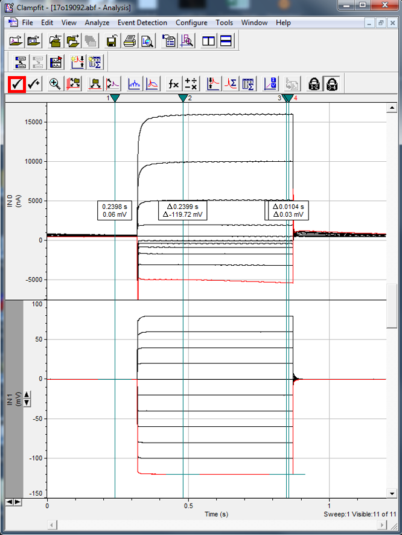

abf2load was developed to open abf2 (.abf) files in R. 

abf2load supports all data recording modes except for event driven variable length mode. Although abf2 data viewing in R is enabled by abf2load, data analysis may not be easily achievable.

vcfunc was developed by the author of abf2load to facilitate abf2 data processing. Here I will present an example (case study) of using abf2load and vcfunc to grab current and voltage data from waveforms and to plot an I/V curve.

To obtain abf2load, please use the following link,
https://github.com/imlijunda/abf2load

Or run the following script to install both abf2load and vcfunc:
```{r}
library(devtools)
devtools::install_github("imlijunda/abf2load")
devtools::install_github("Crystal-YWu/vcfunc")
```


# Case study experiment set up
Xenopus laevis oocytes were injected with either cRNA of gene "A2" or water 2 days before experiment.

A two electrode voltage clamp rig is used for voltage clamp of the oocytes.

Voltage step protocol: 11 steps, from -120mV to +80mV, +20mV per step

- Time settings: 300 ms hold – 550 ms voltage steps – 350 ms hold
- Total time per sweep: 1.2s

Two sets of experiments were performed:

- Run voltage step protocol on oocytes using Basal buffer and 1-100 mM Cl buffers
- Run voltage step protocol on oocytes using Basal buffer and 1-100 mM NO3 buffers: 1N, 5N, 10N, 25N, 50N, 100N

# Loading data file index into R and define data folder path.
A file index is required for identifing the .abf data files. 

Important information about the format of file index:

- 1. Please DO NOT change or remove any column names except for "RestingVoltage" and "Comments".
- 2. When a data file contains Gap free type data, put "Gapfree" in the corresbonding row under the "DataType" column, then the select_samples() function will auto filter out the Gap free data.
- 3. When a data file is NOT to be included in the analysis, put "yes" in the corresbonding row under the "DIsregard?" column, then the select_samples() function will auto filter out the disregarded data.
- 4. Any of the column except for "FileName" can be left empty, when the experiment is not as complicated as the experiment in this case study.


Load "sample data file index.csv" into R studio.
```{r}
library(tidyverse)
library(abf2load)
library(vcfunc)

index=read_csv('sample data file index.csv')
index
```
Define the path of the folder which contains your .abf data.
```{r}
folder='sample data'
```

# Define factors for data sorting
This experiment has used two sets of buffers, one is Cl buffers and the other is NO3 buffers.

- Oocyte 1 to 20 were tested with NO3 (N) buffers, while oocyte 21 to 37 were tested with Cl (C) buffers.
```{r}
C = c(21:37)
N = c(1:20)
```

# Select file names
We want to analyse data of "A2" injected oocytes tested with 50 mM NO3 buffer.

Select the file names from the data file index with the following properties:

- gene: Oocytes injected with the gene "A2"
- oocyteNo: Oocytes tested with N buffers
- buffer: Oocytes tested with 50 mM NO3 buffer (50N)
```{r}
# Select file names from index
selected = select_samples(dataindex = index, 
                          oocyteNo = N, 
                          gene = "A2", 
                          buffer = "50N")
selected 
# Count the number of data files selected
nselected = nrow(selected)
```

# Load data into R
Now use the file names we just selected to load the corresponding .abf files from the defined folder path into R studio, then extract voltage and current channel data of each file into abf_raw.
```{r}
# The selected file names need to be unlisted
abf_raw = abf2.load_in_folder(folder = "sample data/",
                                filename_list = unlist(selected[, "FileName"]))

# We keep abf_raw as a backup so we can easily restore
abf_list = abf_raw

abf_title = unlist(selected[, "FileName"])
```
- This could be a slow process depending on the total size of your .abf files. R studio may look stuck while loading data. Please be patient and wait for it to finish


# Plot voltage and current wave forms

Plot current and voltage wave forms for each loaded file:
```{r}
# Plot all loaded abf files
  # Could be slow depending on how large the list is, note that title_list is optional
PlotAll_IVChannel(abf_list, title_list = abf_title)
```
- Plotting could be a slow process when you have a lot of files. R studio may look stuck while plotting. Please be patient and wait for it to finish.

Alternatively, plot the same channel of all loaded files side by side
```{r}
# Plot all current waveforms
PlotAll_Channel(abf_list, 1, title_list = abf_title)
# Plot all voltage waveforms
PlotAll_Channel(abf_list, 2, title_list = abf_title)
```

# Remove unwanted episodes
To remove the +80 mV episode from the 2nd oocyte:

- Experiment design:
    - Voltage steps: 11 steps, from -120mV to +80mV, +20mV /step
    - Therefore, the +80 mV episode is the 11th episode
```{r}
# Remove epi 11 from file 2
SampleNO = 2
EpiToRemove = c(11)
abf_list[[SampleNO]] = AbfRemoveEpisode(abf_list[[SampleNO]], EpiToRemove)
# Then run plot the wave forms again to check
Plot_IVChannel(abf_list[[SampleNO]])
```
    
# Remove unwanted files
To remove all data of the 2nd oocyte:
```{r}
# Remove the 2nd file name from the selected files
FileToRemove = 2
selected=selected[-FileToRemove,]
nselected = nrow(selected)
# Remove the 2nd oocyte’s data from the V and I channel data list
abf_list=abf_list[-FileToRemove]
# Then run plot all current wave forms again to check
PlotAll_Channel(abf_list, 1, title_list = abf_title)
```

# Restore removed episodes or files
If only episodes have been removed, restore all removed episode by resetting abf_list.
```{r}
abf_list = abf_raw
```

To restore all removed episodes and files, just reload raw data again.
```{r}
selected = select_samples(dataindex = index, 
                          oocyteNo = N, 
                          gene = "A2", 
                          buffer = "50N")
nselected = nrow(selected)
abf_raw = abf2.load_in_folder(folder = "sample data/",
                                filename_list = unlist(selected[, "FileName"]))
abf_list = abf_raw
abf_title = unlist(selected[, "FileName"])
```


# Define “cursor” position
When using clampfit.exe to acquire I V data, you need to bring one or two cursors to the appropriate position then click "tick".



We will do the same in R using either “automatic” or “manual” methods.

## Define “cursor” position: automatic

###Auto method 1: Determine the most stable region (intervals) of the I and V waveforms
Find the most stable interval and plot waveforms with intervals:
```{r}
# Step 1: Find sampling intervals,
intv_list = FindAllSamplingInterval(abf_list)
# Step 2: plot the waveforms and the interval is between the 2 dash lines.
PlotAll_IVChannelWithIntv(abf_list, intv_list, title_list = abf_title)
```

- The mechanism of the above scripts:

    - step 1: Extract your voltage settings and find the most stable interval
        - The most stable region length is 10 ms by default.
        - The most stable region must match the the voltage settings for the experiment +/- max 5% of your voltage step increment.
            - Voltage setting for this sample experiment is: -120 -100  -80  -60  -40  -20    0   20   40   60   80 mV. voltage step increment is 20 mV.
        - If you want the voltage error permit zone to be more than +/- max 5%, search the "FindAllSamplingInterval" function to see how to define the argument "allowed_voltage_delta".
            
    - step 2: plot the waveforms and the selected interval is between the 2 dash lines.

- Another way of plotting:
```{r}
# Alternatively, plot the same channel of all loaded files side by side with selected intervals 
PlotAll_ChannelWithIntv(abf_list, intv_list, 1)
PlotAll_ChannelWithIntv(abf_list, intv_list, 2)
```

If you want to manually define interval for the 2nd oocyte:
```{r}
# Define which sample is selected. E.g. for the 2nd file, sample_id = 2
sample_id = 2
# Define the start point and length of the interval
intv_start = 6200
intv_length = 100
# Change the interval of file 2 in the intv_list
intv_list = ChangeInterval(intv_list, sample_id, intv_start, intv_length)
# Plot to confirm change
Plot_IVChannelWithIntv(abf_list[[sample_id]],intv_list[[sample_id]])
```

###Auto method 2: Backward search interval
When current and voltage stability is not the priority, use backward search to find intervals at the end of the voltage step:
```{r}
intv_list = FindAllSamplingInterval(abf_list, backward_seach = TRUE)
# Check new intervals on waveform plots
PlotAll_ChannelWithIntv(abf_list, intv_list, 1)
PlotAll_ChannelWithIntv(abf_list, intv_list, 2)
intv_list
```

## Define “cursor” position: manual
If you prefer to take I V data at the same time point for all oocytes, you can manually set the interval.

To manually set the all interval start point to 620 ms and plot intervals, run the following script:
```{r}
intv_start = 6200
intv_length = 100
#You can call a function to do this
for (i in 1:nselected){
  intv_list = ChangeInterval(intv_list, i, intv_start, intv_length)
}
intv_list
```

# I V data extraction
In this example, we would like to use the automatically defined intervals.
- Therefore, we run Auto method 1 to define intervals again and to reset intervals to auto values:
```{r}
intv_list = FindAllSamplingInterval(abf_list)
```

When using Clampfit.exe to extract I and V data, usually the average values of the 2 cursors are taken.

In this case study, we want to take the average values in the 10 ms (100 data points, default value) inside the selected interval.

Calculate the mean V and I values between your two “cursors”:
```{r}
df_mean_voltage = AllSamples_VoltageMeans(abf_list, intv_list)
df_mean_current = AllSamples_CurrentMeans(abf_list, intv_list)
# Each row represents one of your 3 selected oocytes
df_mean_current
# When interval cannot be defined for an oocyte using the parameters in auto define interval functions,
  # The results will be returned as NA
```

Calculate the average V and I values (and SEM) for all 3 oocytes and combine these data into a list:
```{r}
df_summary = AllSamples_IVSummary(abf_list, intv_list)
df_summary
# NA is automatically removed when calculating mean and SEM
# Each row represents 1 episode
```

Extract V and I values for each oocyte and combine into a list:
```{r}
# I and V for each individual oocytes
individuals = AllSamples_IVRaw(abf_list, intv_list)
# If you only want the I data of each oocyte:
individualsI = AllSamples_IRaw(abf_list, intv_list)
```


# Save extracted data into lists: for data export and direct plotting in R
Now we want to create several lists:
- Lists for data export: for export of extracted data into .csv files
    - The exported data can be used directly for plotting I V curves in your preferred softwares:
        - e.g. GraphPad Prism, Microsoft excel
```{r}
# 1. a list for buffer names 
  # proc_nameA2N: processed name A2 N
proc_nameA2N = list()
# 2. a list for currents of each oocyte
  # proc_VAA2Nicurrent: processed volt amp A2 N individual oocytes Current only
proc_VAA2Nicurrent = list()
```
- List for I V curve plotting in R:
```{r}
# 3. a list for voltage, SEM voltage, current, SEM current of all oocytes in the same group
  # proc_meanVAA2N: processed mean volt amp A2 N
proc_meanVAA2N = list()
```
- List for conductance calculation in R:
    - Conductance calculation is not a feature of abf2load and vcfunc, therefore it is not included in this example.
```{r}
# 4. a list for voltage and current of each oocyte
  # proc_VAA2Ni: processed volt amp A2 N individual oocytes
proc_VAA2Ni = list()
```

Save the extracted data into the 1st element of these 4 lists:
```{r}
# Buffer name
proc_nameA2N[[1]] = "50 mM NO3"

# Mean and SEM
proc_meanVAA2N[[1]] = df_summary

# I and V of each individual oocyte
proc_VAA2Ni[[1]] = individuals

# I of each individual oocyte
proc_VAA2Nicurrent[[1]] = individualsI

```

Export data to .csv files:
```{r}
write.csv(proc_VAA2Nicurrent[[1]],
          paste(proc_nameA2N[[1]]," individual oocyte currents.csv", sep=""))
```
- The data in the .csv file can be used directly for plotting I V curves in your preferred softwares.


