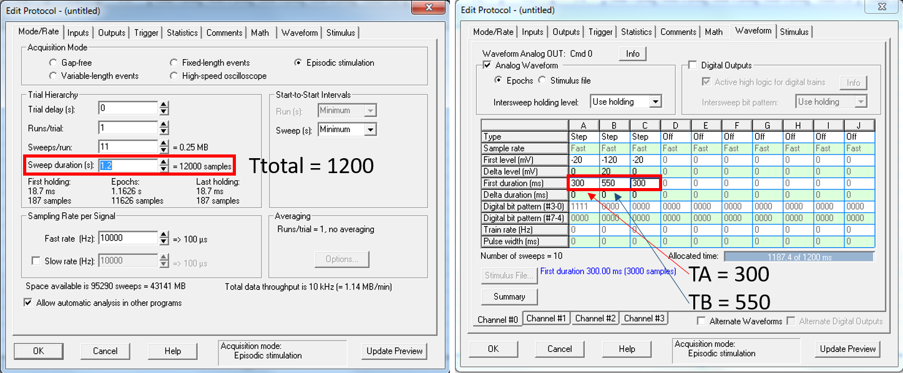
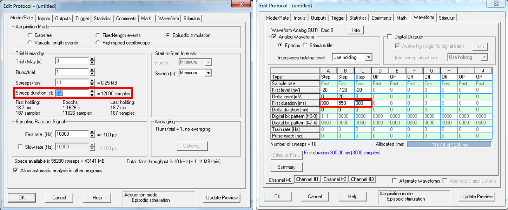
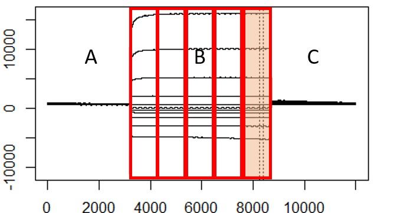

abf2load was developed to open abf2 (.abf) files in R. 

abf2load supports all data recording modes except for event driven variable length mode. Although abf2 data viewing in R is enabled by abf2load, data analysis may not be easily achievable.

vcfunc was developed by the author of abf2load to facilitate abf2 data processing. Here I will present an example (case study) of using abf2load and vcfunc to grab current and voltage data from waveforms and to plot an I/V curve.

To obtain abf2load, please use the following link,
https://github.com/imlijunda/abf2load

Or run the following script:
```{r}
library(devtools)
devtools::install_github("imlijunda/abf2load")
```


# Case study experiment set up
Xenopus laevis oocytes were injected with either cRNA of gene "A2" or water 2 days before experiment.

A two electrode voltage clamp rig is used for voltage clamp of the oocytes.

Voltage step protocol: 11 steps, from -120mV to +80mV, +20mV per step

- Time settings: 300 ms hold – 550 ms voltage steps – 350 ms hold
- Total time per sweep: 1.2s

Two sets of experiments were performed:

- Run voltage step protocol on oocytes using Basal buffer and 1-100 mM Cl buffers
- Run voltage step protocol on oocytes using Basal buffer and 1-100 mM NO3 buffers: 1N, 5N, 10N, 25N, 50N, 100N

# Loading data file index into R and define data folder path.
A file index is required for identifing the .abf data files. 

Important information about the format of file index:

- 1. Please DO NOT change or remove any column names except for "RestingVoltage" and "Comments".
- 2. When a data file contains Gap free type data, put "Gapfree" in the corresbonding row under the "DataType" column, then the select.samples() function will auto filter out the Gap free data.
- 3. When a data file is NOT to be included in the analysis, put "yes" in the corresbonding row under the "DIsregard?" column, then the select.samples() function will auto filter out the disregarded data.
- 4. Any of the column except for "FileName" can be left empty, when the experiment is not as complicated as the experiment in this case study.


Load "sample data file index.csv" into R studio.
```{r}
library(tidyverse)
index=read_csv('sample data file index.csv')
index
```
Define the path of the folder which contains your .abf data.
```{r}
folder='sample data'
```

# Define factors for data sorting
This experiment has used two sets of buffers, one is Cl buffers and the other is NO3 buffers.

- Oocyte 1 to 20 were tested with NO3 (N) buffers, while oocyte 21 to 37 were tested with Cl (C) buffers.
```{r}
C = c(21:37)
N = c(1:20)
```

# Select file names
We want to analyse data of "A2" injected oocytes tested with 50 mM NO3 buffer.

Firstly, we need to load abf2load and vcfunc into R studio
```{r}
library(abf2load)

# Install vcfunc
devtools::install_github("Crystal-YWu/vcfunc")

library(vcfunc)
```
Select the file names from the data file index with the following properties:

- gene: Oocytes injected with the gene "A2"
- oocyteNo: Oocytes tested with N buffers
- buffer: Oocytes tested with 50 mM NO3 buffer (50N)
```{r}
# Select file names from index
selected = select.samples(dataindex = index, 
                          oocyteNo = N, 
                          gene = "A2", 
                          buffer = "50N")
selected 
# Count the number of data files selected
nselected = nrow(selected)
```

# Load data into R
Now use the file names we just selected to load the corresponding .abf files from the defined folder path into R studio
```{r}
# The selected file names need to be unlisted
rawdata = abf2.load_in_folder(folder = folder, 
                              filename = unlist(selected[, "FileName"]))
```
- This could be a slow process depending on the total size of your .abf files. R studio may look stuck while loading data. Please be patient and wait for it to finish

# Extract sample data
From the rawdata, extract voltage and current channel data of each file into sample_list
```{r}
sample_list = list()
for (i in 1:nselected)
{
  sample_list[[i]] = rawdata[[i]]$ByChannel
}
```

# Plot voltage and current wave forms
In order to fit all voltage wave form plots in the same plot window, we need to define plot area np x np.
```{r}
# This is a mathematical process which calculates the optimal plot area
np = 0
for (i in 1:nselected)
  if (i^2 >= nselected)
  {
    np = i
    break
  }
```

Plot all voltage wave forms (with the same y axis scale):

- Firstly, define voltage step time length in milli seconds (ms)

 

```{r}
Ttotal=1200
TA=300
TB=550
```

- Secondly, find max and min values for wave form y axis.
```{r}
yAxisFac1=TA*10+TB*10*0.05
yAxisFac2=TA*10+TB*10*0.95

MaxyAxis=data.frame()
for (i in 1:nselected){
  for (j in 1:2){
    MaxyAxis[i,j]=max(sample_list[[i]][[j]][yAxisFac1:yAxisFac2,])
  }
}

MinyAxis=data.frame()
for (i in 1:nselected){
  for (j in 1:2){
    MinyAxis[i,j]=min(sample_list[[i]][[j]][yAxisFac1:yAxisFac2,])
  }
}
```

- Finally, plot wave forms using the vclamp.plot_channel() function.
    - The following scriop also gets x and y axis information "xyinfo" by vclamp.plot_xy_info()
```{r}
# Define new plot area and plot margins
par(mfrow = c(np, np))
par(mar=c(2,2,2,2))
# Get xyinfo and plot voltage wave forms
xyinfo = list()
for (i in 1:nselected)
{
  xyinfo[[i]] = vclamp.plot_xy_info (abfdata = rawdata[[i]])
  vclamp.plot_channel (sample_channels = sample_list[[i]], 
                       # current channel is 1, voltage is 2
                       chan_id = 2, 
                       xy_info = xyinfo[[i]], 
                       plottitle = i)
}
```
- Plotting could be a slow process when you have a lot of files. R studio may look stuck while plotting. Please be patient and wait for it to finish.

Plot current wave forms using the existing "xyinfo"
```{r}
par(mfrow = c(np, np))
par(mar=c(2,2,2,2))
for (i in 1:nselected)
{
  vclamp.plot_channel(sample_channels = sample_list[[i]], 
		chan_id = 1, 
		xy_info = xyinfo[[i]], 
		plottitle = selected$FileName[i])
}
# Check plottitle to see why now the plots are labbled with file names
```

# Remove unwanted episodes
To remove the +80 mV episode from the 2nd oocyte:

- Experiment design:
    - Voltage steps: 11 steps, from -120mV to +80mV, +20mV /step
    - Therefore, the +80 mV episode is the 11th episode
```{r}
sample_list[[2]] = episode.remove_multi(sample_list[[2]], 11)
# Then run plot all voltage wave forms again to check
par(mfrow = c(np, np))
par(mar=c(2,2,2,2))
for (i in 1:nselected)
{
  vclamp.plot_channel(sample_list[[i]], 
                      2, 
                      xyinfo[[i]], 
                      selected$OocyteNumber[i])
}
```
    
# Remove unwanted files
To remove all data of the 2nd oocyte:
```{r}
# Remove the 2nd file name from the selected files
selected=selected[-2,]
nselected = nrow(selected)
# Remove the 2nd oocyte’s data from the V and I channel data list
sample_list=sample_list[-2]
# Then run plot all voltage wave forms again to check
par(mfrow = c(np, np))
par(mar=c(2,2,2,2))
for (i in 1:nselected)
{
  vclamp.plot_channel(sample_list[[i]], 
                      2, 
                      xyinfo[[i]], 
                      selected$OocyteNumber[i])
}
```

# Restore removed episodes or files
To restore the removed episodes:
```{r}
sample_list = list()
for (i in 1:nselected)
{
  sample_list[[i]] = rawdata[[i]]$ByChannel
}
```
To restore the removed oocytes:
```{r}
selected = select.samples(index, N, "A2", "50N")
nselected = nrow(selected)
sample_list = list()
for (i in 1:nselected)
{
  sample_list[[i]] = rawdata[[i]]$ByChannel
}
```

# Define “cursor” position
When using clampfit.exe to acquire I V data, you need to bring one or two cursors to the appropriate position then click "tick".


We will do the same in R using either “automatic” or “manual” methods.

## Define “cursor” position: automatic
In Clampex.exe, when setting protocol, you have defined the wave form:

 

Use the time lengths, calculate TC in ms (milli seconds)

 


```{r}
TC=Ttotal-TA-TB
```

If you want to acquire data from the final 1/5 of step B:

 


```{r}
# Theoretically you could define this factor anywhere between 0 to 1
restric_factor=1/5
# Then the restriction division factor could be calculated.
  # You will know how this factor is used later
restrict_div = 1/(TC/Ttotal+restric_factor*TB/Ttotal)
```


Run the following script to determine the most stable region (intervals) of the I and V waveforms:

- The mechanism of the following scripts:
    - step 1: Extract your voltage settings into voltage from rawdata
        - e.g., the voltage settings for this sample experiment is: -120 -100  -80  -60  -40  -20    0   20   40   60   80
    - step 2: Find the most stable region in the final 1/5 of step B:
        - interval_pts: interval length = 150 points = 15 ms
        - target_voltages: your voltage settings
        - voltage_threshold: when your actual voltage is within +/- 3.0 mV from your voltage settings, find interval; otherwise, no interval will be found.
        - restriction_div: use the factor restrict_div you calculated to tell the function that you want the interval to be within the final 1/5 of step B.
    - step 3: plot the waveforms and the interval is between the 2 dash lines.
    - step 4: record interval start point and end point. When interval cannot be determined, it will return NA.
```{r}
intervals = data.frame()
for (i in 1:nselected)
{
# step 1
voltage = vclamp.voltage_setting(rawdata[[i]])
# step 2
t = vclamp.best_interval(sample_list[[i]], 
                         interval_pts = 150, 
                         current_chan_id = 1, 
                         voltage_chan_id = 2, 
                         target_voltages = voltage, 
                         voltage_threshold = 3.0,
                         restriction_div=restrict_div)
# step 3
vclamp.plot_interval(sample_list[[i]], t, xyinfo[[i]])
  title(selected$OocyteNumber[i])
# step 4
intervals[i, 1] = t[1]
intervals[i, 2] = t[2]
}
colnames(intervals) <- c("Start", "End")
intervals
```
To manually define interval for the 2nd oocyte:
```{r}
# Define which sample is selected. E.g. for the 2nd oocyte, sampleid=2
sampleid = 2
# Define the start point and length of the interval
IntervalStartTime = 6200
IntervalLength = 150
# Change the interval start and end point of the 2nd oocyte 
intervals[sampleid, "Start"] = IntervalStartTime
intervals[sampleid, "End"] = IntervalStartTime+IntervalLength
# Plot to see if the interval is at a suitable position
t = c(intervals[sampleid, "Start"], intervals[sampleid, "End"])
vclamp.plot_interval(sample_list[[sampleid]], t, xyinfo[[sampleid]])
intervals
```

## Define “cursor” position: manual
If you prefer to take I V data at the same time point for all oocytes, you can manually set the interval.

To manually set the all interval start point to 620ms and plot intervals, run the following script:
```{r}
IntervalStartTime = 6200
IntervalLength = 150

intervals = data.frame()
for (i in 1:nselected)
{
  intervals[i, "Start"] = IntervalStartTime
  intervals[i, "End"] = IntervalStartTime + IntervalLength
  vclamp.plot_interval(sample_list[[i]], 
                       c(intervals[i, "Start"], intervals[i, "End"]), 
                       xyinfo[[i]])
  title(selected$FileName[i])
}
intervals
```

# I V data extraction
Now we can extract mean I and V data between the "cursors" (interval).

In this example, we would like to use the automatically defined intervals.
- Therefore, we run auto define intervals again to reset intervals to auto values:
```{r}
intervals = data.frame()
for (i in 1:nselected)
{
voltage = vclamp.voltage_setting(rawdata[[i]])
t = vclamp.best_interval(sample_list[[i]], 
                         150, 
                         1, 
                         2, 
                         voltage, 
                         3.0,
                         restrict_div)
vclamp.plot_interval(sample_list[[i]], t, xyinfo[[i]])
  title(selected$OocyteNumber[i])
intervals[i, 1] = t[1]
intervals[i, 2] = t[2]
}
colnames(intervals) <- c("Start", "End")
intervals
```


When using Clampfit.exe to extract I and V data, usually the average values of the 2 cursors are taken.

In this case study, we want to take the average values in the 15 ms (150 data points) selected interval.

Calculate the mean V and I values between your two “cursors”:
```{r}
voltagemeans = vclamp.channel_mean(sample_list, intervals, 2)
currentmeans = vclamp.channel_mean(sample_list, intervals, 1)
# Each row represents one of your 3 selected oocytes
currentmeans
# Interval for oocyte 2 was not defined using the parameters in auto define interval
  # Therefore the results are returned as NA
```
Extract V and I values for each oocyte and combine into a list:
```{r}
individuals = vclamp.individual_channel_mean(voltagemeans, currentmeans)
# If you only want the current data of each oocyte:
individualsI = vclamp.individual_IorV_mean(currentmeans)
```
Calculate the average V and I values (and SEM) for all 3 oocytes and combine these data into a list:
```{r}
# NA is automatically removed when calculating mean and SEM
combined = vclamp.combine_channel_mean(voltagemeans, currentmeans)
combined
# Each row represents 1 episode
```

# Save extracted data into lists: for data export and direct plotting in R
Now we want to create several lists:
- Lists for data export: for export of extracted data into .csv files
    - The exported data can be used directly for plotting I V curves in your preferred softwares:
        - e.g. GraphPad Prism, Microsoft excel
```{r}
# 1. a list for buffer names 
  # proc_nameA2N: processed name A2 N
proc_nameA2N = list()
# 2. a list for currents of each oocyte
  # proc_VAA2Nicurrent: processed volt amp A2 N individual oocytes Current only
proc_VAA2Nicurrent = list()
```
- List for I V curve plotting in R:
```{r}
# 3. a list for voltage, SEM voltage, current, SEM current of all oocytes in the same group
  # proc_meanVAA2N: processed mean volt amp A2 N
proc_meanVAA2N = list()
```
- List for conductance calculation in R:
```{r}
# 4. a list for voltage and current of each oocyte
  # proc_VAA2Ni: processed volt amp A2 N individual oocytes
proc_VAA2Ni = list()
```

Save the extracted data into the 1st element of these 4 lists:
```{r}
# Buffer name
proc_nameA2N[[1]] = "50 mM NO3"

# Mean and SEM
proc_meanVAA2N[[1]] = combined

# I and V of each individual oocyte
proc_VAA2Ni[[1]] = individuals

# I of each individual oocyte
proc_VAA2Nicurrent[[1]] = individualsI

```

Export data to .csv files:
```{r}
write.csv(proc_VAA2Nicurrent[[1]],
          paste(proc_nameA2N[[1]]," individual oocyte currents.csv", sep=""))
```


